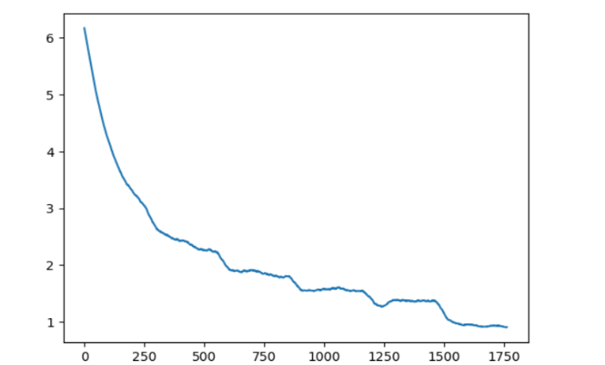
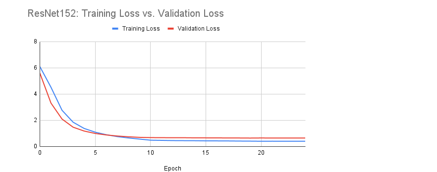
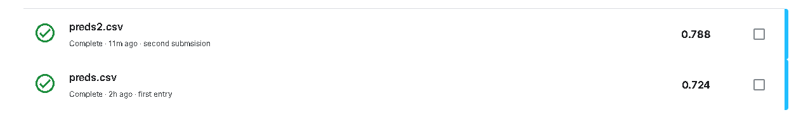

# The Problem

The objective of this project is to develop a machine learning model capable of accurately identifying the species of birds by analyzing the characteristics present in an image. By accomplishing this, the aim is to create a sense of familiarity with these magnificent flying creatures, which have undergone diverse adaptations over millions of years, paralleling the evolution of humans and becoming one of the most varied animal groups on Earth, encompassing over 5,000 distinct species.

# Introduction

In our project, I initially utilized Google Colab as our working environment for a certain duration before transitioning to Jupyter Notebook. I selected the ResNet18 model as our initial pre-trained framework and later expanded our exploration by incorporating ResNet18 algorithm. For the actual training process, computation of loss values, and experimentation with various training techniques, I relied on the PyTorch Python library.

I decided to train and utilize a learning model to classify 10,000 images of birds from a dataset provided by the biannual [Bird Classification Kaggle Competition](https://www.kaggle.com/competitions/birds23sp/data). However, this begged the question: which model should I use to achieve a desired level of classification and how should I adjust this model to perform optimally and accurately?

# Personal Computer Specs
I figured that going into this project, my computer was sustainable enough to run its own training rather than using the Google Colab of which limited my GB usage, of which included were:

* GeForce RTX 3080Ti
* Ryzen 9 5950X
* DDR4 4000mhz 32gb

# How It Started

I began by using the Google Colab as the environment for training my model. I used the dataset that was provided by us from the kaggle website, from then I utilized our code from the classes Pytorch Tutorial to load the dataset and resized the images resolution to 128 pixel by 128 pixel. I kept the training batch size to 128, which was the same as the Pytorch's tutorial, and then modified the model to run for 6 epochs with a learning rate of 0.01 then decreasing to 0.001 after the fifth epoch and a decay of 0.0005. This was the very inital start of the testing that I took so that I could grasp the numbers and the length of each epoch's training.

To start, we would catch the dataset and by doing so, I would use a lot of command lines to load my kaggle.json file to generate the dataset
```
Import Kaggle Dataset
! pip install -q kaggle
! mkdir ~/.kaggle
! cp kaggle.json ~/.kaggle/
! chmod 600 ~/.kaggle/kaggle.json
! kaggle competitions download -c birds23sp
! mkdir 'checkpoints'
# Create checkpoints folder to save models
checkpoints = '/workspace/checkpoints'
```

```
def get_bird_data(augmentation=0):
    transform_train = transforms.Compose([
        transforms.Resize(128),
        transforms.RandomCrop(128, padding=8, padding_mode='edge'), # Take 128x128 crops from padded images
        transforms.RandomHorizontalFlip(),    # 50% of time flip image along y-axis
        transforms.ToTensor(),
    ])
    
    transform_test = transforms.Compose([
        transforms.Resize(128),
        transforms.ToTensor(),
    ])
    trainset = torchvision.datasets.ImageFolder(root='birds/train', transform=transform_train)
    trainloader = torch.utils.data.DataLoader(trainset, batch_size=128, shuffle=True, num_workers=2)

    testset = torchvision.datasets.ImageFolder(root='birds/test', transform=transform_test)
    testloader = torch.utils.data.DataLoader(testset, batch_size=1, shuffle=False, num_workers=2)
    classes = open("birds/names.txt").read().strip().split("\n")
    class_to_idx = trainset.class_to_idx
    idx_to_class = {int(v): int(k) for k, v in class_to_idx.items()}
    idx_to_name = {k: classes[v] for k,v in idx_to_class.items()}
    return {'train': trainloader, 'test': testloader, 'to_class': idx_to_class, 'to_name':idx_to_name}

data = get_bird_data()
```
The code above helped us load and processed the dataset that was provided with us from the Kaggle Competition

```
def smooth(x, size):
  return np.convolve(x, np.ones(size)/size, mode='valid')
plt.plot(smooth(losses,50))

state = torch.load(checkpoints + 'checkpoint-10.pk1')
plt.plot(smooth(state['losses'], 50))
```
The code above helped us generate the results from training the model.
```
def predict(net, dataloader, ofname):
    out = open(ofname, 'w')
    out.write("path,class\n")
    net.to(device)
    net.eval()
    correct = 0
    total = 0
    with torch.no_grad():
        for i, (images, labels) in enumerate(dataloader, 0):
            if i%100 == 0:
                print(i)
            images, labels = images.to(device), labels.to(device)
            outputs = net(images)
            _, predicted = torch.max(outputs.data, 1)
            fname, _ = dataloader.dataset.samples[i]
            out.write("test/{},{}\n".format(fname.split('/')[-1], data['to_class'][predicted.item()]))
    out.close()

net = torch.hub.load('pytorch/vision:v0.6.0', 'resnet18', pretrained=True)
net.fc = nn.Linear(512, 555)
state = torch.load(checkpoints + 'checkpoint-10.pk1')
net.load_state_dict(state['net'])

predict(net, data['test'], checkpoints + "preds.csv")
```

# How It is Going

After awhile, I swapped around the numbers and tinkered with the amount of epochs I used which initally was 6, to 7 of which the time difference was very minimal.


I personally made adjustments to the neural network based on the class code, specifically by modifying the values using the get_bird_data() function. I conducted three separate training sessions for Resnet152, making various changes to optimize the code and achieve the best possible results.

Throughout the training process, I followed the same approach. I utilized the PyTorch library to load a pre-trained ResNet152 model. However, I had to make a crucial modification to the nn.Linear(512, 555) part, replacing it with nn.Linear(2048, 555) since the ResNet152 model had an in-features value of 2048.

In the initial training of the ResNet152 model, I chose to maintain a similar preprocessing approach as ResNet18. This decision allowed me to have some degree of control during the first round of training, with only minor adjustments made to ensure the model's smooth progression through the training process.



During the preprocessing, a significant modification I made was resizing the images to 224x224 pixels. I discovered through research that the ResNet model had been trained on images of this resolution. Additionally, I adjusted the padding to 16 and changed the batch size to 32 to accommodate the change in resolution. Another decision I made was to normalize the images during dataset loading. This adjustment consistently improved our accuracy and ultimately yielded better results.

The first ResNet152 training with adjusted value ran a total of 6 epochs at learning rate .001 and decay of 0.0005

The second round of ResNet152 model training with adjusted value ran a total of 7 epochs at learning rate .001 and a decay of 0.0005

In my preprocessing, a notable change I made was resizing the images to 224x224 pixels. This adjustment was based on further research, which revealed that the ResNet model had been trained on images with this resolution. Additionally, I modified the padding to be 16 and adjusted the batch size to 32 to accommodate the change in resolution.

Furthermore, I made the decision to normalize the images during the dataset loading process. However, I observed that this led to a decrease in accuracy. Nevertheless, the consistency in the results obtained with this normalization approach ultimately contributed to better overall performance.



# Final Results & Submissions



# Closing Thoughts