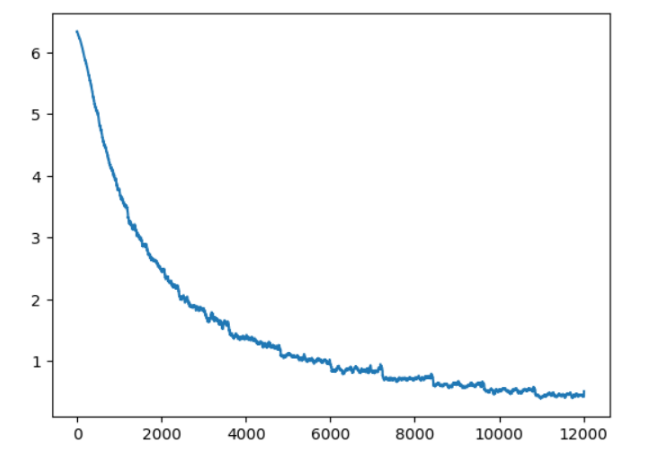

# The Problem

The objective of this project is to develop a machine learning model capable of accurately identifying the species of birds by analyzing the characteristics present in an image. By accomplishing this, the aim is to create a sense of familiarity with these magnificent flying creatures, which have undergone diverse adaptations over millions of years, paralleling the evolution of humans and becoming one of the most varied animal groups on Earth, encompassing over 5,000 distinct species.

# Introduction

In our project, I initially utilized Google Colab as our working environment for a certain duration before transitioning to Jupyter Notebook. I selected the ResNet18 model as our initial pre-trained framework and later expanded our exploration by incorporating ResNet18 algorithm. For the actual training process, computation of loss values, and experimentation with various training techniques, I relied on the PyTorch Python library.

I decided to train and utilize a learning model to classify 10,000 images of birds from a dataset provided by the biannual [Bird Classification Kaggle Competition](https://www.kaggle.com/competitions/birds23sp/data). However, this begged the question: which model should I use to achieve a desired level of classification and how should I adjust this model to perform optimally and accurately?

# How It Started

I began by using the Google Colab as the environment for training my model. I used the dataset that was provided by us from the kaggle website, from then I utilized our code from the classes Pytorch Tutorial to load the dataset and resized the images resolution to 128 pixel by 128 pixel. I kept the training batch size to 128, which was the same as the Pytorch's tutorial, and then modified the model to run for 6 epochs with a learning rate of 0.01 then decreasing to 0.001 after the fifth epoch and a decay of 0.0005. This was the very inital start of the testing that I took so that I could grasp the numbers and the length of each epoch's training.

```
def get_bird_data(augmentation=0):
    transform_train = transforms.Compose([
        transforms.Resize(128),
        transforms.RandomCrop(128, padding=8, padding_mode='edge'), # Take 128x128 crops from padded images
        transforms.RandomHorizontalFlip(),    # 50% of time flip image along y-axis
        transforms.ToTensor(),
    ])
    
    transform_test = transforms.Compose([
        transforms.Resize(128),
        transforms.ToTensor(),
    ])
    trainset = torchvision.datasets.ImageFolder(root='birds/train', transform=transform_train)
    trainloader = torch.utils.data.DataLoader(trainset, batch_size=128, shuffle=True, num_workers=2)

    testset = torchvision.datasets.ImageFolder(root='birds/test', transform=transform_test)
    testloader = torch.utils.data.DataLoader(testset, batch_size=1, shuffle=False, num_workers=2)
    classes = open("birds/names.txt").read().strip().split("\n")
    class_to_idx = trainset.class_to_idx
    idx_to_class = {int(v): int(k) for k, v in class_to_idx.items()}
    idx_to_name = {k: classes[v] for k,v in idx_to_class.items()}
    return {'train': trainloader, 'test': testloader, 'to_class': idx_to_class, 'to_name':idx_to_name}

data = get_bird_data()
```
The code above helped us load and processed the dataset that was provided with us from the Kaggle Competition

```
def smooth(x, size):
  return np.convolve(x, np.ones(size)/size, mode='valid')
plt.plot(smooth(losses,50))

state = torch.load(checkpoints + 'checkpoint-10.pk1')
plt.plot(smooth(state['losses'], 50))
```
The code above helped us generate the results from training the model.
```
def predict(net, dataloader, ofname):
    out = open(ofname, 'w')
    out.write("path,class\n")
    net.to(device)
    net.eval()
    correct = 0
    total = 0
    with torch.no_grad():
        for i, (images, labels) in enumerate(dataloader, 0):
            if i%100 == 0:
                print(i)
            images, labels = images.to(device), labels.to(device)
            outputs = net(images)
            _, predicted = torch.max(outputs.data, 1)
            fname, _ = dataloader.dataset.samples[i]
            out.write("test/{},{}\n".format(fname.split('/')[-1], data['to_class'][predicted.item()]))
    out.close()

net = torch.hub.load('pytorch/vision:v0.6.0', 'resnet18', pretrained=True)
net.fc = nn.Linear(512, 555)
state = torch.load(checkpoints + 'checkpoint-10.pk1')
net.load_state_dict(state['net'])

predict(net, data['test'], checkpoints + "preds.csv")
```
